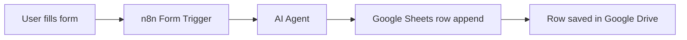

# n8n DevGeekWeek 2026

Self-hosted n8n with Docker Compose and PostgreSQL (or MySQL).

## Prerequisites

- [Docker Desktop](https://www.docker.com/products/docker-desktop/) (Windows, macOS, or Linux)
- [Node.js](https://nodejs.org/) (for the seed script)

## Quick start (PostgreSQL)

Run the steps in order. The seed script connects to PostgreSQL from your machine, so **Docker Compose must be running first**.

### Step 1 — Start Docker Compose

```bash
docker compose up -d
```

Wait until the containers are healthy. You can check with:

```bash
docker compose ps
```

### Step 2 — Seed the database

After PostgreSQL is up, install dependencies and run the seed script:

```bash
npm install
npm run seed
```

This creates a separate database named `dev_geek_week` with sample **users**, **cars**, and **user–car relations**. You can run `npm run seed` again anytime to reset the sample data.

### Step 3 — Open the apps

| App     | URL                                            |
| ------- | ---------------------------------------------- |
| n8n     | [http://localhost:5678](http://localhost:5678) |
| pgAdmin | [http://localhost:5050](http://localhost:5050) |

**pgAdmin login**

- Email: `admin@local.dev`
- Password: `pgadmin_password_change_me`

**Register the PostgreSQL server in pgAdmin**

| Field    | Value                                          |
| -------- | ---------------------------------------------- |
| Host     | `postgres`                                     |
| Port     | `5432`                                         |
| Database | `n8n` (or `dev_geek_week` to view seeded data) |
| Username | `n8n`                                          |
| Password | `n8n_password_change_me`                       |

**Verify seeded data from the terminal**

```bash
docker exec -it n8n-postgres psql -U n8n -d dev_geek_week -c "SELECT u.name, c.make, c.model, uc.relation_type FROM user_cars uc JOIN users u ON u.id = uc.user_id JOIN cars c ON c.id = uc.car_id;"
```

## Use MySQL instead

```bash
docker compose -f docker-compose.yml -f docker-compose.mysql.yml up -d
```

The seed script is for PostgreSQL only. Skip `npm run seed` when using the MySQL stack.

## Lab 1 — User form to agent to Google Drive

Build an n8n workflow that collects user information from a simple form, processes it with an AI agent, and saves the result as a new row in Google Drive.

### Objective

Automate the flow from user input → AI processing → spreadsheet storage, without manual copy/paste.

### Prerequisites

Complete the setup steps above:

1. `docker compose up -d`
2. Open n8n at [http://localhost:5678](http://localhost:5678)
3. Connect your accounts in n8n:
   - **Google Drive** (or **Google Sheets**) OAuth credentials
   - **AI agent** credentials (OpenAI, Anthropic, or another supported provider)

### Form requirements

Create a simple form with **4 user information fields**:

| Field     | Type  | Example           |
| --------- | ----- | ----------------- |
| Full Name | Text  | Alice Johnson     |
| Email     | Email | alice@example.com |
| Phone     | Text  | +1-555-0100       |
| Job Title | Text  | Software Engineer |

Use the **n8n Form Trigger** node (or an equivalent form/webhook trigger) so submitting the form starts the workflow.

### Workflow requirements

Your workflow must include the following steps:

1. **Form Trigger** — capture the 4 fields when the user submits the form.
2. **AI Agent node** — send the submitted data to an agent and ask it to:
   - Validate the input (e.g. email format, missing fields)
   - Normalize or enrich the data (e.g. format phone number, clean name casing)
   - Return structured output ready for storage (JSON or row values)
3. **Google Drive / Google Sheets node** — append the agent output as a **new row** in a spreadsheet stored in Google Drive.

Suggested sheet columns:

| Full Name | Email | Phone | Job Title | Processed At | Agent Notes |
| --------- | ----- | ----- | --------- | ------------ | ----------- |

### Expected flow



### Acceptance criteria

- [ ] Form displays exactly 4 input fields for user information
- [ ] Submitting the form triggers the workflow automatically
- [ ] Form data is passed to the AI agent node
- [ ] Agent returns structured, usable output (not free-text only)
- [ ] A new row is appended to a Google Sheet in your Google Drive
- [ ] The row contains the user data (original and/or agent-processed values)
- [ ] Workflow runs successfully end-to-end from a test submission

### Tips

- Use **Google Sheets → Append Row** rather than uploading a file on each submission — this is the standard way to add rows via Google Drive integration.
- Test with one submission first, then confirm the row appears in the sheet before adding error handling.
- Keep the agent prompt explicit: tell it which fields to return and in what format (e.g. JSON with keys matching your sheet columns).
- Name your workflow `Lab 1 - User Form to Google Drive` so it is easy to find and review.

## Useful commands

```bash
# View logs
docker compose logs -f n8n

# Stop
docker compose down

# Stop and remove volumes (deletes all data)
docker compose down -v

# Update to latest n8n image
docker compose pull && docker compose up -d

# Re-seed sample data (Docker must be running)
npm run seed
```

## Seed script details

The seed script lives in `scripts/seed.js` and is run with `npm run seed`. It must be executed **after** `docker compose up -d`, because it connects to PostgreSQL on `localhost:5432`.

Connection settings are hardcoded to match `docker-compose.yml`:

| Setting          | Value                    |
| ---------------- | ------------------------ |
| Host             | `localhost`              |
| Port             | `5432`                   |
| User             | `n8n`                    |
| Password         | `n8n_password_change_me` |
| Database created | `dev_geek_week`          |

If the seed fails with a connection error, make sure Docker Compose is running and recreate the stack:

```bash
docker compose up -d
npm run seed
```

## Configuration

All settings are hardcoded in `docker-compose.yml`. Before production use, edit these values directly in the compose file:

- `N8N_ENCRYPTION_KEY` — set a long random string and keep it stable across restarts
- `POSTGRES_PASSWORD` / `DB_POSTGRESDB_PASSWORD` — database password
- `N8N_HOST`, `WEBHOOK_URL`, `N8N_PROTOCOL` — update when exposing n8n beyond localhost

## Optional local bind mounts

By default, data is stored in Docker named volumes (works on Windows, macOS, and Linux). To use local folders instead, edit the `volumes` sections in the compose files:

```yaml
# n8n data
- ./data/n8n:/home/node/.n8n

# PostgreSQL data
- ./data/postgres:/var/lib/postgresql/data

# MySQL data (docker-compose.mysql.yml)
- ./data/mysql:/var/lib/mysql
```

Create the folders first if they do not exist:

```bash
mkdir -p data/n8n data/postgres
```
